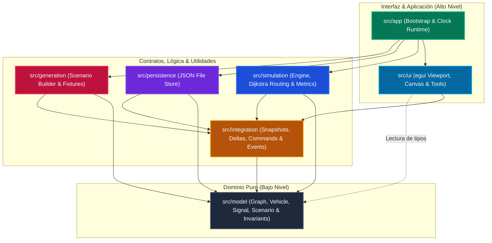

# Arquitectura del simulador de tráfico

Este documento describe la estructura técnica e implementada del proyecto en Rust, garantizando la separación estricta de responsabilidades entre el motor lógico y el visualizador interactivo.

## 1. Estructura del proyecto actual

El proyecto está diseñado bajo una arquitectura limpia y desacoplada, donde:

- El núcleo de dominio es puro y estable.
- El motor de simulación concentra la mutación de estado.
- Una capa de integración define contratos de snapshots, deltas y eventos.
- Una capa de interfaz gráfica (UI) consume snapshots y emite comandos al motor.

La regla principal de dependencias es simple: **el modelo no depende de nada, la simulación depende del modelo, la UI depende de la capa de integración y la aplicación ensambla todo**.

## 2. Flujo de dependencias

La dirección de dependencias en el código es la siguiente:

| Capa | Puede depender de |
| --- | --- |
| `app` | todas |
| `ui` | `integration` y tipos de lectura de `model` |
| `integration` | `model` |
| `simulation` | `model` e `integration` |
| `generation` | `model` e `integration` |
| `model` | ninguna capa de alto nivel |

El flujo en tiempo de ejecución queda así:

`ui (presentación) -> integration -> app -> simulation -> model`

Y para la carga y generación de escenarios:

`generation -> model -> integration -> simulation`

### Diagrama de la Arquitectura y Dependencias



## 3. Estructura de archivos del proyecto

La distribución real de archivos y directorios es la siguiente:

```text
.
├─ Cargo.toml
├─ README.md
├─ documentation/
│  ├─ architecture.md
│  ├─ idea-simulador.md
│  ├─ idea-motor.md
│  ├─ idea-visualizador.md
│  ├─ plan-simulador.md
│  ├─ plan-motor.md
│  ├─ plan-visualizador.md
│  └─ plan-integracion.md
├─ assets/
│  └─ lucide.ttf
├─ src/
│  ├─ main.rs
│  ├─ lib.rs
│  ├─ app/
│  │  ├─ mod.rs
│  │  ├─ bootstrap.rs
│  │  ├─ clock.rs
│  │  └─ runtime.rs
│  ├─ model/
│  │  ├─ mod.rs
│  │  ├─ ids.rs
│  │  ├─ scenario.rs
│  │  ├─ graph.rs
│  │  ├─ road.rs
│  │  ├─ vehicle.rs
│  │  ├─ signal.rs
│  │  ├─ state.rs
│  │  └─ invariants.rs
│  ├─ simulation/
│  │  ├─ mod.rs
│  │  ├─ engine.rs
│  │  ├─ tick.rs
│  │  ├─ routing.rs
│  │  ├─ movement.rs
│  │  ├─ conflicts.rs
│  │  ├─ metrics.rs
│  │  └─ validation.rs
│  ├─ generation/
│  │  ├─ mod.rs
│  │  ├─ builders.rs
│  │  ├─ loaders.rs
│  │  ├─ fixtures.rs
│  │  └─ scenario_factory.rs
│  ├─ integration/
│  │  ├─ mod.rs
│  │  ├─ commands.rs
│  │  ├─ events.rs
│  │  ├─ snapshots.rs
│  │  ├─ delta.rs
│  │  ├─ protocol.rs
│  │  └─ codec.rs
│  ├─ ui/
│  │  ├─ mod.rs
│  │  └─ screens/
│  │     ├─ mod.rs
│  │     └─ simulator/
│  │        ├─ mod.rs
│  │        ├─ bars/
│  │        │  ├─ mod.rs
│  │        │  ├─ menu_bar.rs
│  │        │  └─ status_bar.rs
│  │        ├─ canvas/
│  │        │  ├─ mod.rs
│  │        │  ├─ grid.rs
│  │        │  ├─ render_cache.rs
│  │        │  └─ viewport.rs
│  │        ├─ components/
│  │        │  ├─ mod.rs
│  │        │  └─ sidebar.rs
│  │        ├─ geom/
│  │        │  ├─ mod.rs
│  │        │  ├─ angles.rs
│  │        │  ├─ collisions.rs
│  │        │  ├─ distance.rs
│  │        │  └─ triangulation.rs
│  │        ├─ state/
│  │        │  ├─ mod.rs
│  │        │  └─ window_state.rs
│  │        └─ tools/
│  │           ├─ mod.rs
│  │           ├─ building_tool.rs
│  │           ├─ delete_tool.rs
│  │           ├─ inspect_tool.rs
│  │           └─ road_tool.rs
│  └─ persistence/
│     ├─ mod.rs
│     ├─ file_store.rs
│     ├─ serializer.rs
│     └─ migrations.rs
└─ tests/
   └─ smoke.rs
```

## 4. Responsabilidad de cada capa

### `src/main.rs`
Solo arranca la aplicación. No contiene lógica de negocio ni de interfaz. Su trabajo es delegar al bootstrap en `src/lib.rs`.

### `src/lib.rs`
Fachada pública del proyecto. Reexporta el punto de arranque de la aplicación.

### `src/app`
Raíz de composición y runtime. Maneja la inicialización, la creación de la ventana principal y la sincronización del reloj lógico del simulador con los frames de renderizado.

### `src/model`
Contiene datos puros y tipos estables de dominio. Aquí viven IDs de entidades, el grafo vial, vehículos, semáforos y las validaciones de invariantes lógicas. No realiza operaciones de I/O ni renderizado.

### `src/simulation`
Motor lógico de simulación. Ejecuta las fases del tick, el cálculo de movimiento lógico de vehículos, el ruteo dinámico por Dijkstra, las penalizaciones por congestión, la resolución de colas/prioridades y la generación de métricas y eventos.

### `src/generation`
Módulo encargado de la creación procedural y configuración de escenarios (mediante patrones como Builder y Factory), facilitando la escritura de escenarios de prueba.

### `src/integration`
Capa de contratos y mensajería que conecta el motor y la UI. Define la estructura de snapshots completos, snapshots delta de actualización, comandos y eventos. Asegura que el motor no se acople a la interfaz gráfica.

### `src/ui`
Interfaz gráfica interactiva en `egui`. Dibuja la rejilla, las carreteras trazadas y los edificios. Procesa los eventos de ratón/teclado y administra herramientas de dibujo geométricas específicas con snapping magnético y colisiones físicas.

### `src/persistence`
Almacenamiento y serialización de escenarios en archivos JSON, aislando el formato de almacenamiento del modelo en memoria.

## 5. Patrones de diseño implementados

- **Composition Root**: El arranque y la inyección de dependencias de la UI se configuran en `src/app` e `ui/mod.rs`.
- **Command**: Las interacciones y peticiones de cambio en el escenario se estructuran mediante comandos estables en `src/integration/commands.rs`.
- **Strategy**: El motor de rutas (`src/simulation/routing.rs`) e interpolación de desplazamientos se puede calibrar o intercambiar sin alterar el bucle principal.
- **State**: La máquina de estados de vehículos (`VehicleState`), fases semafóricas (`SignalPhase`) y estados globales se definen formalmente en los contratos.
- **Builder**: Facilita la creación simplificada y legible de redes viales y vehículos en tests (`ScenarioBuilder`).
- **Facade**: `lib.rs` expone una interfaz pequeña y limpia para el arranque del programa.

## 6. Reglas de arquitectura

- **No acoplamiento de UI**: Ningún tipo en `src/model` o `src/simulation` puede depender de `egui` o de librerías visuales.
- **Determinismo**: La simulación lógica debe correr exclusivamente en el hilo del backend utilizando estructuras de datos deterministas (evitando iteración sobre `HashMap` no ordenados donde el orden altere el desempate de colas; se prefiere `BTreeMap`).
- **Paso por snapshots**: La interfaz gráfica de usuario lee el estado del motor exclusivamente a través de los snapshots y deltas emitidos por `SimulationEngine`.
- **Paso por comandos**: Toda mutación en el escenario provocada por el usuario (como trazar calles) debe enviarse como comandos al motor para su validación y aplicación.
- **Geometría desacoplada**: El progreso de los vehículos se calcula en metros lógicos en el motor. La UI es responsable exclusiva de proyectar y escalar este progreso a coordenadas de pantalla (2D).