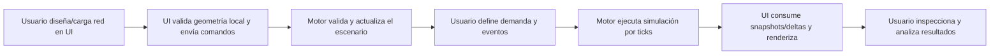
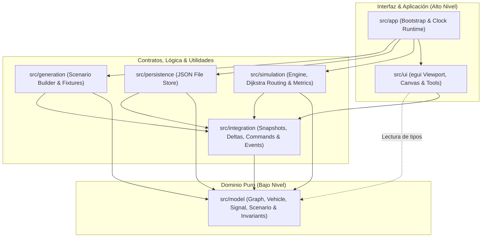

# Documentación Consolidada del Proyecto: Simulador de Tráfico

Este documento consolida toda la documentación del proyecto existente en la carpeta `documentation/`, unificando la visión conceptual, la arquitectura técnica, las especificaciones de diseño y las hojas de ruta del Simulador de Tráfico en un único archivo de referencia.

---

## Índice

1. [Visión General e Idea del Simulador](#1-visión-general-e-idea-del-simulador)
2. [Arquitectura del Sistema y Estructura del Proyecto](#2-arquitectura-del-sistema-y-estructura-del-proyecto)
3. [Especificación Conceptual y Técnica del Motor (Backend)](#3-especificación-conceptual-y-técnica-del-motor-backend)
4. [Especificación Conceptual y Técnica del Visualizador (Frontend)](#4-especificación-conceptual-y-técnica-del-visualizador-frontend)
5. [Capa de Integración, Mensajería y Contratos](#5-capa-de-integración-mensajería-y-contratos)
6. [Planes de Trabajo y Hojas de Ruta de Desarrollo](#6-planes-de-trabajo-y-hojas-de-ruta-de-desarrollo)

---

## 1. Visión General e Idea del Simulador

### 1.1. Propósito Global
El propósito de este proyecto en Rust es construir una plataforma de simulación de tráfico urbano y suburbano que permita diseñar, ejecutar y analizar redes viales completas con un comportamiento determinista, escenarios reproducibles y visualización interactiva de escritorio.

El sistema sirve para:
* **Modelar redes viales:** Representar grafos viales precisos (nodos, tramos, carriles).
* **Simular vehículos:** Modelar movimiento físico, comportamiento en cola, semáforos y congestión.
* **Editar interactivamente:** Diseñar redes viales y colocar obstáculos mediante herramientas geométricas.
* **Analizar rendimiento:** Recopilar métricas de tráfico (tiempos de viaje, colas, esperas) y exportarlas.
* **Garantizar reproducibilidad:** Asegurar que, con la misma semilla aleatoria y red, la simulación produzca exactamente el mismo resultado (determinismo monohilo).

### 1.2. División Funcional
El proyecto se divide estrictamente en tres capas lógicas:
1. **Backend / Motor de Simulación:** Ejecuta la lógica discreta por ticks. No tiene conocimiento del sistema gráfico o I/O de renderizado.
2. **Frontend / Visualizador Interactivo:** Interfaz gráfica nativa construida con `eframe` y `egui` que renderiza el escenario e interactúa con el usuario.
3. **Capa de Integración y Contratos:** Estructuras comunes (snapshots, deltas, comandos y eventos) que permiten a la UI y al motor comunicarse de forma desacoplada.

### 1.3. Flujo General del Producto


---

## 2. Arquitectura del Sistema y Estructura del Proyecto

El proyecto está diseñado bajo un monolito modular con separación estricta de responsabilidades. La regla principal es que **el modelo no depende de nada, la simulación depende del modelo, la UI depende de la capa de integración y la aplicación ensambla todo**.

### 2.1. Dirección de Dependencias

| Capa | Puede depender de |
| :--- | :--- |
| `app` | Todas las capas |
| `ui` | `integration` y lectura de tipos de `model` |
| `integration` | `model` |
| `simulation` | `model` e `integration` |
| `generation` | `model` e `integration` |
| `persistence` | `model` e `integration` |
| `model` | Ninguna capa (dominio puro) |

### 2.2. Diagrama de Arquitectura


### 2.3. Estructura de Directorios y Archivos
El árbol físico del código fuente está estructurado de la siguiente forma:

```text
src/
├── app/          # Inicialización (bootstrap), runtime de egui y reloj lógico
│   ├── mod.rs
│   ├── bootstrap.rs
│   ├── clock.rs
│   └── runtime.rs
├── generation/   # Generación procedural de escenarios (Builders, Fixtures)
│   ├── mod.rs
│   ├── builders.rs
│   ├── loaders.rs
│   ├── fixtures.rs
│   └── scenario_factory.rs
├── integration/  # Contratos compartidos, snapshots, deltas de estado y eventos
│   ├── mod.rs
│   ├── commands.rs
│   ├── events.rs
│   ├── snapshots.rs
│   ├── delta.rs
│   ├── protocol.rs
│   └── codec.rs
├── model/        # Datos puros de dominio (grafo, vehículos, semáforos)
│   ├── mod.rs
│   ├── ids.rs
│   ├── scenario.rs
│   ├── graph.rs
│   ├── road.rs
│   ├── vehicle.rs
│   ├── signal.rs
│   ├── state.rs
│   └── invariants.rs
├── persistence/  # Serialización y guardado de escenarios en archivos JSON
│   ├── mod.rs
│   ├── file_store.rs
│   ├── serializer.rs
│   └── migrations.rs
├── simulation/   # Motor de simulación determinista (routing, tick engine, métricas)
│   ├── mod.rs
│   ├── engine.rs
│   ├── tick.rs
│   ├── routing.rs
│   ├── movement.rs
│   ├── conflicts.rs
│   ├── metrics.rs
│   └── validation.rs
└── ui/           # Interfaz gráfica de usuario en egui
    ├── mod.rs
    └── screens/
        ├── mod.rs
        └── simulator/
            ├── mod.rs
            ├── bars/        # Barra superior de menú y barra inferior de estado
            │   ├── mod.rs
            │   ├── menu_bar.rs
            │   └── status_bar.rs
            ├── canvas/      # Rejilla infinita y manejo de viewport
            │   ├── mod.rs
            │   ├── grid.rs
            │   ├── render_cache.rs
            │   └── viewport.rs
            ├── components/  # Paneles laterales y menús de herramientas
            │   ├── mod.rs
            │   └── sidebar.rs
            ├── geom/        # Lógica geométrica (triangulación, colisiones)
            │   ├── mod.rs
            │   ├── angles.rs
            │   ├── collisions.rs
            │   ├── distance.rs
            │   └── triangulation.rs
            ├── state/       # Persistencia de la ventana y estados de GUI
            │   ├── mod.rs
            │   └── window_state.rs
            └── tools/       # Herramientas de dibujo interactivo
                ├── mod.rs
                ├── building_tool.rs
                ├── delete_tool.rs
                ├── inspect_tool.rs
                └── road_tool.rs
```

### 2.4. Responsabilidades de las Capas
* **`src/main.rs` & `src/lib.rs`:** Fachadas mínimas de arranque del simulador.
* **`src/app`:** Runtime global. Sincroniza el bucle de renderizado gráfico de la UI con la lógica temporal del reloj del simulador.
* **`src/model`:** Tipos e identificadores estables (`VehicleId`, `NodeId`, etc.), representación pura del grafo de transporte e invariantes del dominio. Exento de librerías visuales.
* **`src/simulation`:** Motor de física lógica. Implementa la lógica de avance continuo en metros lógicos, replanificación con Dijkstra dinámico, desempates en colas FIFO y acumulación de métricas de tráfico.
* **`src/generation`:** Inicialización procedural de redes y escenarios de prueba.
* **`src/integration`:** Definición de mensajes ( snapshots, deltas, eventos, comandos) para el intercambio limpio entre la simulación y la UI.
* **`src/ui`:** Control interactivo en 2D. Maneja el zoom/paneo de la rejilla, lógica de trazado (carreteras elásticas y edificios poligonales), colisiones visuales y borrado.
* **`src/persistence`:** Entrada y salida de escenarios guardados en disco (JSON).

### 2.5. Patrones de Diseño Implementados
* **Composition Root:** Configuración centralizada de dependencias en `src/app` y `ui/mod.rs`.
* **Command:** Interacciones de edición encapsuladas en `src/integration/commands.rs`.
* **Strategy:** Ruteo dinámico (`routing.rs`) e interpolación intercambiable.
* **State:** Máquinas de estado explícitas en vehículos (`VehicleState`) y fases de semáforos (`SignalPhase`).
* **Builder:** Patrón implementado (`ScenarioBuilder`) para crear redes viales complejas de forma declarativa.
* **Facade:** Exposición minimalista del punto de entrada en `lib.rs`.

---

## 3. Especificación Conceptual y Técnica del Motor (Backend)

El motor lógico implementa una simulación microscópica de tráfico por pasos de tiempo discretos (ticks).

### 3.1. Entidades del Dominio Lógico
1. **Red Vial (Grafo):** Formado por Nodos (vértices) y Tramos (aristas dirigidas).
2. **Nodo:** Punto de unión, bifurcación o intersección. Puede estar semaforizado, tener prioridad fija, actuar como sumidero (salida) o fuente (entrada).
3. **Tramo:** Vía dirigida que une dos nodos. Contiene uno o más Carriles.
4. **Carril:** Subdivisión del tramo con orden FIFO para vehículos, longitud y capacidad efectiva.
5. **Vehículo:** Agente móvil con identificador único, tipo (automóvil, bus, camión, motocicleta, emergencia), origen, destino, estado de ruta y telemetría de viaje.
6. **Semáforo:** Máquina de fases que regula qué giros/movimientos del nodo de salida están autorizados.

### 3.2. Ciclo del Tick
Cada tick ejecuta secuencialmente las siguientes fases para garantizar que no haya dependencias de orden de inserción u operaciones asíncronas no deseadas:

```text
Tick N:
 ├── [1. Fase de Lectura]
 │     ├── Captura de estado inicial (Snapshot de lectura)
 │     ├── Spawn programado de nuevos vehículos
 │     ├── Planificación y reruteo (cálculo de Dijkstra con costes dinámicos)
 │     ├── Evaluación de semáforos (cambios de fase lógica)
 │     └── Detección de incidentes o bloqueos viales
 └── [2. Fase de Aplicación]
       ├── Actualización del estado semafórico (rojo/amarillo/verde)
       ├── Desplazamiento de vehículos (metros lógicos)
       ├── Transferencia de vehículos entre colas FIFO
       ├── Remoción de vehículos en sumideros
       └── Registro de métricas y eventos estructurados
```

* **Regla de oro:** Las decisiones lógicas de movimiento se toman evaluando la instantánea del inicio del tick. Un vehículo transferido de una arista a otra en el tick `N` no puede seguir avanzando ni abandonar su nueva posición hasta el tick `N+1`.

### 3.3. Lógica de Ruteo Dinámico y Congestión
El motor utiliza una variante de **Dijkstra** para calcular rutas óptimas en base a un coste de arista dinámico:

$$\text{Costo} = \text{Tiempo Base} \times \left(1 + \alpha \cdot \text{Ocupación Relativa} + \beta \cdot \text{Cola Relativa} + \gamma \cdot \text{Bloqueo} + \delta \cdot \text{Penalización Semáforo}\right)$$

Donde:
* **Ocupación Relativa:** Vehículos activos en el tramo / Capacidad del tramo.
* **Cola Relativa:** Vehículos en cola de entrada / Capacidad de almacenamiento.
* **Bloqueo:** Variable de degradación (0 si está libre, 1 parcial, 2 si hay cierre total).
* **Penalización Semáforo:** Tiempo estimado de espera según la fase semafórica.

#### Replanificación y Evitación de Oscilaciones:
Para simular conductores realistas y evitar bucles infinitos u oscilaciones absurdas de rutas (ir y volver constantemente entre dos tramos adyacentes):
* Se limita el número total de replanificaciones por vehículo.
* Se mantiene un historial de tramos visitados recientemente.
* Se aplica un factor de inercia o media móvil en el costo de los tramos.
* **Recuperación de Deadlocks:** Si un vehículo pasa más de un umbral de ticks detenido sin avanzar en una intersección por saturación extrema, se fuerza un desvío o una liberación excepcional para evitar el congelamiento completo del escenario.

### 3.4. Reglas de Prioridad y Desempate determinista
Cuando múltiples vehículos compiten por entrar a un carril o cruzar una intersección en el mismo tick, el conflicto se desempata estrictamente bajo el siguiente orden de prioridad:
1. **Vehículo de Emergencia** (prioridad de paso absoluta).
2. **Transporte Público / Autobuses**.
3. **Mayor tiempo en espera activa** (FIFO del carril).
4. **Vehículo que llegó primero a la cola**.
5. **Identificador numérico más bajo del vehículo** (desempate matemático determinista final).

### 3.5. Estabilidad y Determinismo en Rust
Para evitar que el orden aleatorio de las tablas Hash afecte las decisiones lógicas (lo cual rompería el determinismo al compilar en diferentes plataformas o ejecutar la misma semilla):
* Se prefiere el uso de `BTreeMap` o `BTreeSet` en lugar de `HashMap`/`HashSet` cuando el orden del bucle de simulación dependa del recorrido de las colecciones.
* Si se utiliza `HashMap`, se inicializa con un hasher de semillas fijas determinista.

---

## 4. Especificación Conceptual y Técnica del Visualizador (Frontend)

El visualizador (desarrollado en `egui`) actúa como una ventana de visualización interactiva y editor de geometría.

### 4.1. Filosofía de la UI
* **La UI representa el estado, no lo calcula:** No calcula rutas ni física de vehículos. Consume los snapshots lógicos del motor.
* **La edición propone cambios:** Las carreteras trazadas por el usuario se convierten en propuestas de diseño que luego se envían como comandos estructurados al motor para su validación formal.

### 4.2. Modos de Operación
1. **Modo Diseño:** Permite construir la red vial. Ofrece herramientas de arrastre, trazado de calles, rotación, redimensionamiento y unión de nodos.
2. **Modo Ejecución:** Controles de reproducción temporal (Play, Pausa, Reset, avance por tick discreto). Renderiza vehículos en movimiento e ilustra semáforos activos.
3. **Modo Depuración:** Dibuja sobre el lienzo los identificadores lógicos (`NodeId`, `SegmentId`), vectores de dirección de carriles, cajas de colisión y rutas alternativas calculadas.
4. **Modo Análisis:** Capas termográficas. Dibuja los tramos coloreados según su nivel de congestión dinámica calculado en el backend (verde a rojo).

### 4.3. Espacio Visual: Lienzo 2D y Viewport
* **Rejilla Infinita:** Un fondo modular elástico implementado con renderizado eficiente basado en un cache de líneas.
* **Cámara 2D:** Permite paneo y zoom elástico fluido con el ratón.
* **Sistema de Coordenadas:** Conversión matemática bidireccional estable entre coordenadas de pantalla física (píxeles) y coordenadas lógicas del mundo del simulador (metros).
* **Renderizado por Capas:**
  1. Fondo/Grid de referencia.
  2. Geometría asfáltica de tramos.
  3. Marcas de carril y líneas divisoras.
  4. Semáforos e Intersecciones.
  5. Vehículos (interpolados).
  6. Capas analíticas e información de depuración.

### 4.4. Herramientas de Edición e Interactividad
* **Road Tool (Trazado de carreteras):** Dibuja tramos continuos arrastrando el ratón con snapping magnético (alineación automática de nodos cercanos). Permite configurar el número de carriles sobre la marcha.
* **Building Tool (Dibujo de obstáculos/edificios):** Permite dibujar polígonos convexos o cóncavos cerrados. Utiliza un algoritmo de triangulación por orejas (*Ear Clipping*) para poder renderizarlos correctamente como formas rellenas en `egui`.
* **Detección de Colisiones:** Impide geométricamente que el usuario dibuje carreteras que se superpongan directamente con los polígonos de los edificios en tiempo de diseño.
* **Delete Tool (Borrado selectivo):** Soporta borrado directo por clic, lazo interactivo (lasso selection) o eliminación de segmentos geométricos individuales (sub-polígonos).
* **Inspector Base:** Panel que se despliega al seleccionar nodos, tramos o vehículos mostrando su estado interno de telemetría e historial en tiempo real.

---

## 5. Capa de Integración, Mensajería y Contratos

Esta capa define las estructuras e interfaces a través de las cuales el motor e UI se comunican de forma asíncrona u orientada a eventos.

### 5.1. Flujo de Datos
```text
  ┌───────────┐                         ┌─────────────┐
  │           │   Commands (Edición)    │             │
  │           ├────────────────────────►│             │
  │    UI     │                         │ Simulation  │
  │ (egui App)│◄────────────────────────┤   Engine    │
  │           │   Snapshots & Deltas    │             │
  └───────────┘                         └─────────────┘
```

### 5.2. Tipos de Mensajes
1. **Commands (Comandos):** Peticiones emitidas por el visualizador para alterar la lógica del escenario. Ejemplo: `CreateRoad { from, to, lanes }`, `DeleteNode { id }`, `InjectVehicle { origin, destination }`.
2. **Snapshots Completos:** Estado exhaustivo de todo el escenario de simulación en un tick específico. Se utiliza para la inicialización de la UI, rebobinados (Reset) o sincronizaciones tras pérdida de datos.
3. **Deltas de Actualización:** Mensajes optimizados que solo contienen la información que cambia tick a tick (progreso métrico de vehículos, cambios de estado de semáforos, alertas activas). Evita transferir la geometría estática de la red en cada paso de tiempo.
4. **Events (Eventos de Simulación):** Hitos importantes que ocurren en el motor. La UI los usa para generar logs de eventos o reproducir efectos visuales puntuales (ej. colisiones, vehículos completados).
5. **Persistencia JSON:** Formato interoperable estructurado que almacena la configuración de la red, demanda e incidentes con versionado de esquema (`CONTRACT_VERSION = 1`).

---

## 6. Planes de Trabajo y Hojas de Ruta de Desarrollo

A continuación se detallan las fases de implementación diseñadas para ordenar el progreso del proyecto, identificando las tareas completadas y los hitos pendientes.

### 6.1. Hojas de Ruta del Motor (Backend)
* **Fase 0: Contratos y Modelo Base [COMPLETADA]**
  - Definición de structs y enums del dominio (`Vehicle`, `SignalPhase`, etc.).
  - Implementación de orden y fases del tick.
  - Validación lógica inicial de invariantes.
* **Fase 1: Red Vial y Carga de Escenarios [COMPLETADA]**
  - Estructuración del grafo vial.
  - Formato JSON de persistencia.
  - Validaciones topológicas.
* **Fase 2: Motor por Ticks y Movilidad Base [COMPLETADA]**
  - Bucle de simulación discreto.
  - Vehículos desplazándose lógicamente sobre los carriles.
  - Colas FIFO y semáforos básicos.
* **Fase 3: Congestión, Rutas dinámicas e Incidencias [COMPLETADA]**
  - Ruteo dinámico con Dijkstra y costo dinámico.
  - Replanificación y desvíos ante incidencias.
  - Prevención de bloqueos y oscilaciones.
* **Fase 4: Métricas, Trazabilidad y Observabilidad [COMPLETADA]**
  - Captura de métricas por nodo/tramo y globales.
  - Historial de eventos y snapshots del motor.
* **Fase 5: Validación, Estrés y Escala [COMPLETADA]**
  - Pruebas de estrés y suites de integración automática (`tests/smoke.rs`).
  - Verificación del determinismo.
* **Fase 6: Extensibilidad y Endurecimiento [PLANIFICADA]**
  - Interfaces intercambiables de políticas de control.
  - Calibración de parámetros y demanda compleja.

### 6.2. Hoja de Ruta de la UI (Frontend)
* **Fase 0: Base de Interfaz [COMPLETADA]**
  - Paneles de la ventana principal (`SimuladorApp`).
  - Lienzo inicial y barra de herramientas lateral.
* **Fase 1: Lienzo y Representación [COMPLETADA]**
  - Zoom y paneo fluido.
  - Sistema de coordenadas y marcas de asfalto estables.
* **Fase 2: Edición Geométrica Interactiva [COMPLETADA]**
  - Snapping en carreteras (`RoadTool`).
  - Triangulación y dibujo de obstáculos (`BuildingTool`).
  - Colisiones físicas y borrado selectivo (`DeleteTool`).
* **Fase 3: Observación de Simulación en Tiempo Real [PLANIFICADA - SIGUIENTE PASO]**
  - Conectar el `SimulationEngine` dentro del bucle de la UI.
  - Renderizar vehículos móviles e interpolar su progreso visual en pantalla.
  - Mostrar visualmente el estado de los semáforos.
  - Integrar controles de reproducción (Play, Pause, Reset, Tick).
* **Fase 4: Análisis y Depuración Visual [PLANIFICADA]**
  - Capas térmicas de congestión.
  - Resaltado de rutas individuales de vehículos.
* **Fase 5: Pulido y Ajuste de Escala [PLANIFICADA]**
  - Optimización de rendimiento con alta densidad vehicular.
  - Atajos de teclado y consistencia general.

### 6.3. Hoja de Ruta de Integración
* **Fase 0: Modelo Compartido [COMPLETADA]**
  - Identificadores estables y tipos base comunes en `src/model`.
* **Fase 1: Snapshots y Estados [COMPLETADA]**
  - Definición de snapshots completos y actualizaciones delta.
* **Fase 2: Comandos y Eventos [PARCIALMENTE COMPLETADA]**
  - Estructuración de comandos de edición y eventos de tráfico.
  - *Pendiente:* Acoplar el runtime dinámico de egui con el envío de comandos al motor.
* **Fase 3: Persistencia y Serialización [COMPLETADA]**
  - Implementación de JSON file store y restauración determinista.
* **Fase 4: Compatibilidad y Pruebas extremo a extremo [PARCIALMENTE COMPLETADA]**
  - Validaciones cruzadas de datos.
  - *Pendiente:* Pruebas de interacción y reproducción completa desde la GUI.
